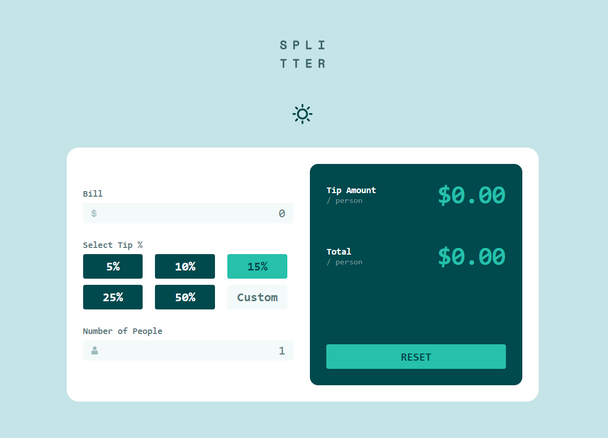
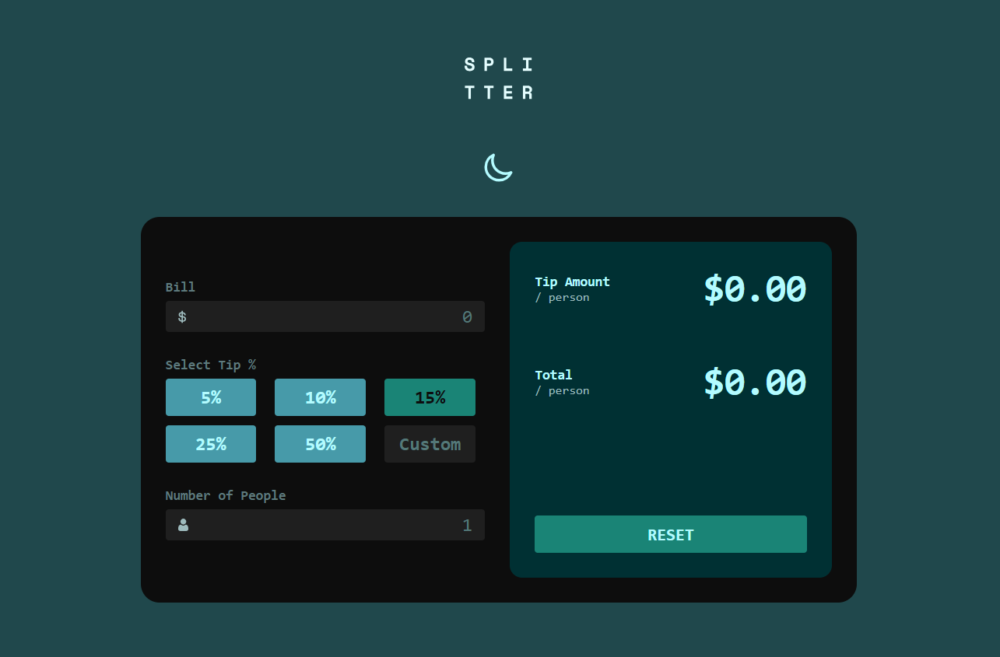

# Frontend Mentor - Tip calculator app solution

This is my solution to the [Tip calculator app challenge on Frontend Mentor](https://www.frontendmentor.io/challenges/tip-calculator-app-ugJNGbJUX). Frontend Mentor challenges help you improve your coding skills by building realistic projects.

## Table of contents

- [Overview](#overview)
  - [The challenge](#the-challenge)
  - [Screenshot](#screenshot)
  - [Links](#links)
- [My process](#my-process)
  - [Built with](#built-with)
  - [What I learned](#what-i-learned)
- [Author](#author)

## Overview

### The challenge

Users should be able to:

- View the optimal layout for the app depending on their device's screen size
- See hover states for all interactive elements on the page
- Calculate the correct tip and total cost of the bill per person

### Screenshot
As an added challenge, I decided to create a theme toggle for this project. I added a separate set of color variables closely related to those for the default theme, and a button to switch between themes:

**Light Theme**

**Dark Theme**

### Links

- Solution URL: [GitHub repo](https://your-solution-url.com)
- Live Site URL: [https://tip-calculator-solution-ajs.netlify.app/](https://tip-calculator-solution-ajs.netlify.app/)

## My process

### Built with

- Vite (Vanilla JS)
- Semantic HTML5 markup
- CSS custom properties
- Flexbox
- CSS Grid
- Sass mixins

### What I learned
In this challenge, I was able to get some more practice (always a good thing!) writing semantic HTML, as well as using the BEM naming convention for CSS classes.

Additionally, I was able to solidify a strategy I intend to use, going forward, for creating a maintainable light-theme/dark-theme toggle.

## Author

- Website - [Andrew J Shea]()
- Frontend Mentor - [@ashea29](https://www.frontendmentor.io/profile/ashea29)
- GitHub - [ashea29](https://github.com/ashea29)
- LinkedIn - [Andrew J Shea](https://www.linkedin.com/in/andrew-j-shea/)
